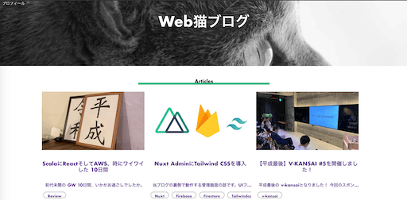

# webneko-blog-ver2

Nuxt + TypeScript + Contentful

## ビルド

```bash
# Local Dev Server
yarn dev
```

### トップページ


### ブログ詳細ページ


## 設計原則

- Atomic Designで言うatomsに最小単位コンポーネントを、templatesにテンプレートを設定する。ただしこれらのコンポーネントでは、Vuexストアにアクセスしない。
- 各エンティティごとに小〜中規模程度のコンポーネントを設定する。Vuexストアにアクセスしても良い。
   - asyncDataメソッドでブログコンテンツを取得。slugオプションを利用して、各ページコンテンツを取得する必要があった。
   - post / profile / layouts / contact
